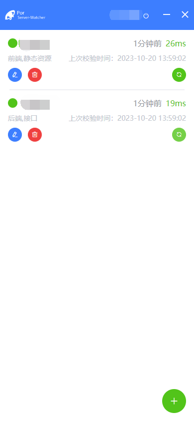

# por-server-watcher

> 服务器静态资源、接口监听工具

根据设定的http/https请求节点，定时（每分钟）的向服务器发起请求。

请求正常返回数据时，工具任务服务/静态资源正常。否则会弹出系统级别的提示。工具的使用electron开发。

数据存储在服务器，服务端技术为express、数据库使用MongoDB。

## 设定

设定名称、http/https请求地址、标签

## 自动请求

列表中的内容工具会自动请求校验，也可手动触发校验

